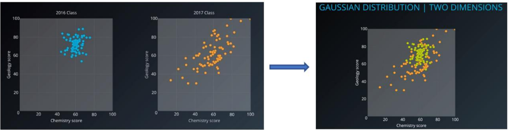
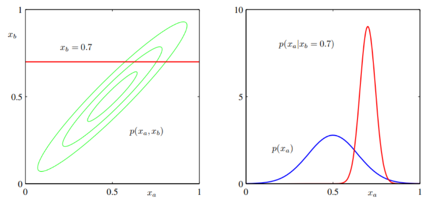

# Gaussian Mixture Model From Scratch - Include Expectation-Maximization Algorithm
----

<!-- TABLE OF CONTENTS -->

  
Table of Contents

  <ol>
    <li><a href="#intoduction">Introduction</a></li>
    <li><a href="#components-of-learning">Components of Learning</a></li>
    <li>
      <a href="#expectation-maximization-algorithm">Expectation-Maximization Algorithm</a>
      <ul>
        <li><a href="#1-gaussian-mixture">1. Gaussian Mixture</a></li>
        <li><a href="#2-maximum-likelihood">2. Maximum Likelihood</a></li>
        <li><a href="#3-expectation-maximization-method-(em)">3. Expectation-Maximization Method (EM)</li>
       </ul>
    <li>
        <a href="#pseudocode-GMM-algorithm">Pseudocode GMM Algorithm</a>
        <ul>
            <li><a href="#3-1-initialization-of-weight,-means,-covariance-and-inverse-covariance">3.1 Initialization of weights, means, covariance and inverse covariance</a></li>
            <li><a href="#3-2-expectation-maximization-step-(em)">3.2 Expectation-Maximization Step (EM)</a></li>
            <li><a href="#3-3-predicted-clusters-of-n_samples">3.3 Predicted Clusters of n_samples</a</li>>
        </ul>
        </li>
    <li>
      <a href="#test-make_blobs-dataset">Test make_blobs Dataset</a>
    </li>
  </ol>

<!-- Introduction -->
# Introduction

&emsp;&emsp;Modelling real dataset using single Gaussian distribution can suffers from significant limitations while kernel
density of dataset showing two or more Gaussians distribution. The algorithm work by grouping instance into certain
groups or cluster that generated by a Gaussian distribution. Gaussian Mixture initialize the covariances of the cluster
based on the covariance type that represent the distribution of each cluster.

<figcaption style="text-align: center; font-size: 12px;"><b><i>Figure 1</b> Gaussian Mixture Model toward data</i> </figcaption>
</figure>

&emsp;&emsp; While K-Means algorithm work by grouping instance into certain cluster based on the closest distance between
the points to the centroid using Euclidean distance, K-Means algorithm also does not estimate the covariances of the
cluster. (<i>[Figure 2](#figure2)</i>)

<figcaption style="text-align: center; font-size: 12px"><b><i>Figure 2.</b> K-Means Clustering toward data</i></figcaption>

GMM model is a probabilistic model that assumes the instances were generated from two or more certain
Gaussians distribution whose parameters is unknown. All the instances generated from a single Gaussian distribution
form a cluster that typically looks like an ellipsoid with different ellipsoidal shape, size, density, and orientation.

<figcaption style="text-align:center;font-size:12px"><b><i>Figure 3.</b>Gaussian cluster with different ellipsoidal, shape, size, density and orientation</i></figcaption>

Let’s see how dataset with two or more Gaussians Distribution by visualize it into two dimensions (<i>[Figure 4](#figure4)</i>).
Sometimes the dataset contains the superposition of two Gaussians cluster, which Gaussian Mixture will tease it apart,
whichever point to have the highest probability to have come from each Gaussians is classified as belonging to a separate
cluster.

<figcaption style="text-align: center; font-size: 12px"><b><i>Figure 4.</b> Two class with its own Multivariate Gaussian distribution (Left), Consider we mixed the dataset and remove the label,
composite dataset would not be Gaussian, but we know it’s composed of two Gaussians distribution (Right).</i></figcaption>

(<a href="#readme-top">back to top</a>)

# Components of Learning

- Hypothesis: 
&emsp;&emsp;instances were generated from two or more certain Gaussians distribution whose parameters is unknown.

- Parameters:  
&emsp;&emsp;<b>Weights, Mean, Covariance, Responsibilities.</b>

- Learning Algorithms:  
&emsp;&emsp;Objective: Maximize weighted log-likelihood   
&emsp;&emsp;by: <i>Expectation-Maximization</i> method

- Input:  
&emsp;&emsp;X: Input data

- Output:  
&emsp;&emsp;Centroids 
&emsp;&emsp;Labels

- Hyperparameters: 
&emsp;&emsp;<b>k</b>&emsp;&emsp;&emsp;&emsp;: number of centroids  
&emsp;&emsp;<b>n_init</b>&emsp;&emsp;: number of initialization 
&emsp;&emsp;<b>max_iter</b> : maximum iteration 
&emsp;&emsp;<b>tol</b>&emsp;&emsp;&emsp;: Change of norm weighted log-likelihood (converged parameter) 
&emsp;&emsp;<b>covariance type</b> : {full, tied, spherical, diag}

(<a href="#readme-top">back to top</a>)

# Expectation-Maximization Algorithm

## 1. Gaussian Mixture
-----
Expectation-Maximization is a method in Gaussian algorithm in order to finding maximum likelihood solutions
for model with <b><i>latent variable</i></b> (McLachlan and Khrisnan, 1997). To give better understanding how EM method works,
given a K-Dimensional binary random variable z having a 1-of-K representation in which a particular element $z_k$ is equal
to 1 and all other elements are equal to 0. The value of zk therefore satisfy $z_k \ Є \ (0,1) \ \text{and} \sum{} z_k = 1$. <b>This value become
first initialization of our algorithm that stored in value named <i>responsibilities.</i></b> The value $z_k$ is filled based on 2-D array
of ((n_clusters, n_features, n_features)), which the value of features in certain n-clusters will be valued as 1 and others
will be 0. <b>It simply store as 1 in order of which cluster is the closest one to the point-i.</b>

We shall define the joint distribution $P(x,z)$ in terms of marginal distribution $P(z)$ and a conditional distribution
$P(x|z)$ (<b>[Figure 5](#figure5)</b>). We noted that the mean of the conditional distribution $P(x_a|x_b)$ was a linear function of $x_b$.

<figcaption style="text-align:center;font-size:12px;"><b>Figure 5.</b> (left) shows the contours of a Gaussian distribution <i>P(xa, xb)</i> over two variables, (right) shows the marginal distribution <i>P(xa)</i> (blue curve) and the conditional distribution <i>P(xa|xb)</i> for xb = 0.7 </figcaption>

Here we shall suppose that we are given a Gaussian marginal distribution $p(x)$ and a Gaussian conditional distribution $P(x|z)$ in which has a mean that is a liner function of x, and a covariance which is independent of x. <b> The marginal distribution over z is specified in terms of the mixing coefficients $π_k$ </b> with:

$$p(z_k=1) = π_k$$

Where the parameter $ 0 \leq π_k \leq 1$, together given $\sum_{i=1}^{K}π_k=1$.

Similarly, the condition distribution of $x$ given a particular value for $z$ is a Gaussian $p(x|z_k=1)$ describe by:

$$ p(x|z_k=1) = \mathcal{N}(x|μ_k, ƹ_k) $$