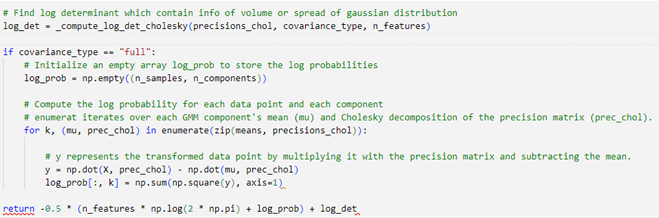
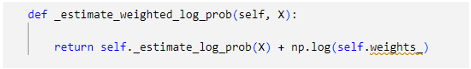
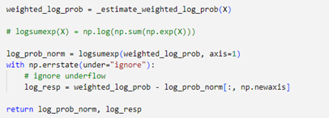
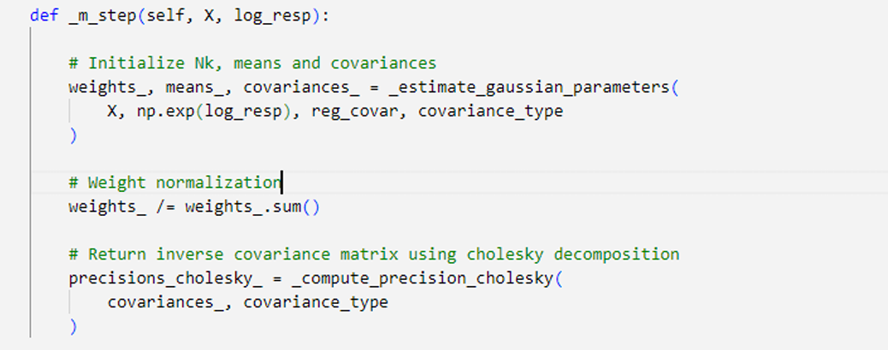
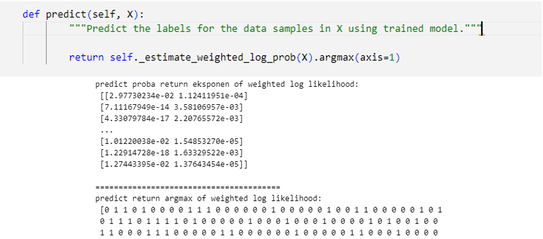
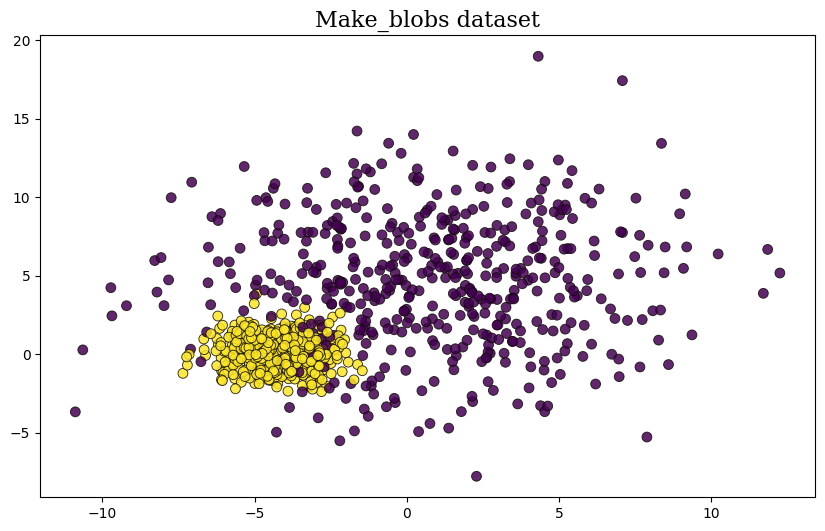
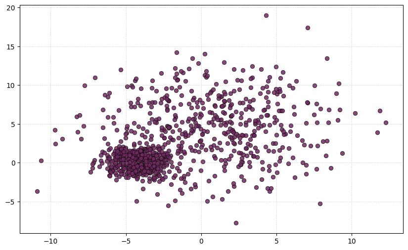
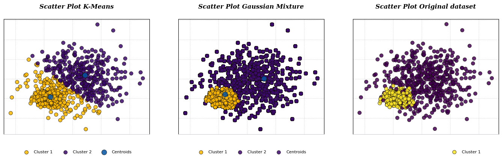
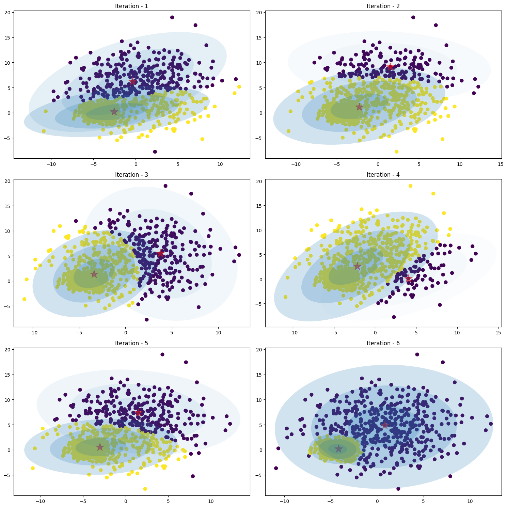
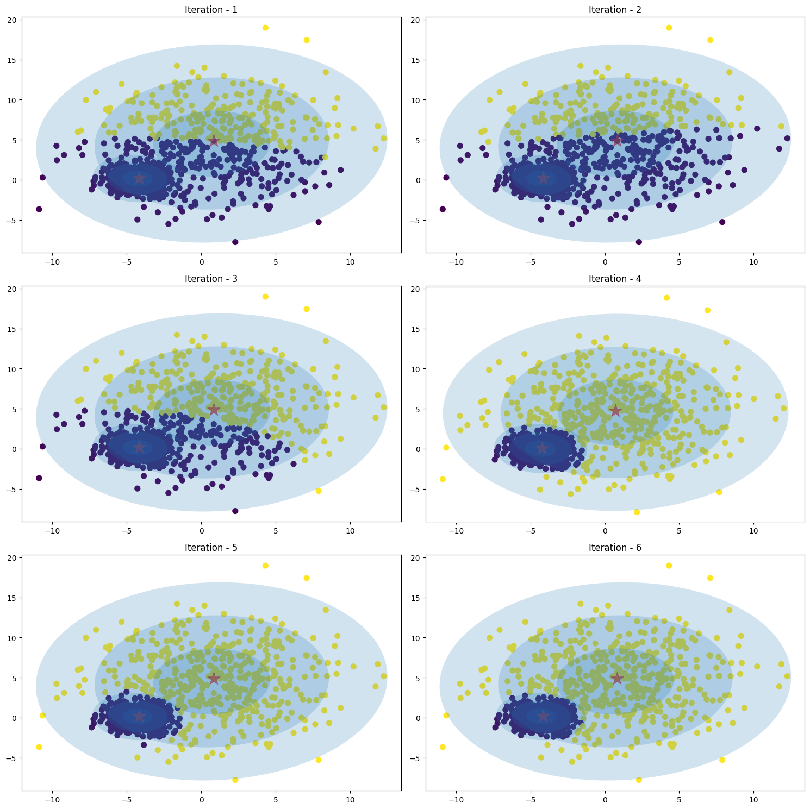

# Gaussian Mixture Model From Scratch - Include Expectation-Maximization Algorithm
----
<a name="readme-top"></a>

<!-- TABLE OF CONTENTS -->
<details>
  <summary>Table of Contents</summary>
  <ol>
    <li><a href="#intoduction">Introduction</a></li>
    <li><a href="#components-of-learning">Components of Learning</a></li>
    <li>
      <a href="#expectation-maximization-algorithm">Expectation-Maximization Algorithm</a>
      <ul>
        <li><a href="#1-gaussian-mixture">1. Gaussian Mixture</a></li>
        <li><a href="#2-maximum-likelihood">2. Maximum Likelihood</a></li>
        <li><a href="#3-expectation-maximization-method-em">3. Expectation-Maximization Method (EM)</li>
       </ul>
    <li>
        <a href="#pseudocode-of-gmm-algorithm">Pseudocode of GMM Algorithm</a>
        <ul>
            <li><a href="#1-initialization-of-weight-mean-and-covariance">1. Initialization of weights, means, and covariance</a></li>
            <li><a href="#2-expectation-step-e-step">2. Expectation Step (E-Step)</a></li>
            <li><a href="#3-maximization-step-m-step">3. Maximization Step (M-Step)</a></li>
            <li><a href="#4-predicted-clusters-of-n_samples">4. Predicted Clusters of n_samples</a></li>
        </ul>
        </li>
    <li>
      <a href="#test-make_blobs-dataset">Test make_blobs Dataset</a>
    </li>
  </ol>
</details>

<!-- Introduction -->
# Introduction

&emsp;&emsp;Modelling real dataset using single Gaussian distribution can suffers from significant limitations while kernel
density of dataset showing two or more Gaussians distribution. The algorithm work by grouping instance into certain
groups or cluster that generated by a Gaussian distribution. Gaussian Mixture initialize the covariances of the cluster
based on the covariance type that represent the distribution of each cluster.


<p align="center">

<figcaption style="text-align: center; font-size: 12px;"><b><i>Figure 1</b> Gaussian Mixture Model toward data</i> </figcaption>
</figure>
</p>

&emsp;&emsp; While K-Means algorithm work by grouping instance into certain cluster based on the closest distance between
the points to the centroid using Euclidean distance, K-Means algorithm also does not estimate the covariances of the
cluster. (<i>[Figure 2](#figure2)</i>)

<p align="center" id="figure2">

<figcaption style="text-align: center; font-size: 12px"><b><i>Figure 2.</b> K-Means Clustering toward data</i></figcaption>
</p>

GMM model is a probabilistic model that assumes the instances were generated from two or more certain
Gaussians distribution whose parameters is unknown. All the instances generated from a single Gaussian distribution
form a cluster that typically looks like an ellipsoid with different ellipsoidal shape, size, density, and orientation.

<p align="center">

<figcaption style="text-align:center;font-size:12px"><b><i>Figure 3.</b>Gaussian cluster with different ellipsoidal, shape, size, density and orientation</i></figcaption>
</p>

Let’s see how dataset with two or more Gaussians Distribution by visualize it into two dimensions (<i>[Figure 4](#figure4)</i>).
Sometimes the dataset contains the superposition of two Gaussians cluster, which Gaussian Mixture will tease it apart,
whichever point to have the highest probability to have come from each Gaussians is classified as belonging to a separate
cluster.

<p align="center" id="figure4">

<figcaption style="text-align: center; font-size: 12px"><b><i>Figure 4.</b> Two class with its own Multivariate Gaussian distribution (Left), Consider we mixed the dataset and remove the label,
composite dataset would not be Gaussian, but we know it’s composed of two Gaussians distribution (Right).</i></figcaption>
</p>

<p align="right">(<a href="#readme-top">back to top</a>)</p>

# Components of Learning

- Hypothesis:<br>
&emsp;&emsp;instances were generated from two or more certain Gaussians distribution whose parameters is unknown.

- Parameters: <br>
&emsp;&emsp;<b>Weights, Mean, Covariance, Responsibilities.</b>

- Learning Algorithms: <br>
&emsp;&emsp;<b>Objective: Maximize weighted log-likelihood</b> <br><br>
&emsp;&emsp;by: <i>Expectation-Maximization</i> method

- Input: <br>
&emsp;&emsp;X: Input data

- Output: <br>
&emsp;&emsp;Centroids<br>
&emsp;&emsp;Labels

- Hyperparameters:<br>
&emsp;&emsp;<b>k</b>&emsp;&emsp;&emsp;&emsp;: number of centroids <br>
&emsp;&emsp;<b>n_init</b>&emsp;&emsp;: number of initialization<br>
&emsp;&emsp;<b>max_iter</b> : maximum iteration<br>
&emsp;&emsp;<b>tol</b>&emsp;&emsp;&emsp;: Change of norm weighted log-likelihood (converged parameter)<br>
&emsp;&emsp;<b>covariance type</b> : {full, tied, spherical, diag}

<p align="right">(<a href="#readme-top">back to top</a>)</p>

# Expectation-Maximization Algorithm

## 1. Gaussian Mixture
-----
Expectation-Maximization is a method in Gaussian algorithm in order to finding maximum likelihood solutions
for model with <b><i>latent variable</i></b> (McLachlan and Khrisnan, 1997). To give better understanding how EM method works,
given a K-Dimensional binary random variable z having a 1-of-K representation in which a particular element $z_k$ is equal
to 1 and all other elements are equal to 0. The value of zk therefore satisfy $z_k \ Є \ (0,1) \ \text{and} \sum{} z_k = 1$. <b>This value become
first initialization of our algorithm that stored in value named <i>responsibilities.</i></b> The value $z_k$ is filled based on 2-D array
of ((n_clusters, n_features, n_features)), which the value of features in certain n-clusters will be valued as 1 and others
will be 0. <b>It simply store as 1 in order of which cluster is the closest one to the point-i.</b>

We shall define the joint distribution $P(x,z)$ in terms of marginal distribution $P(z)$ and a conditional distribution
$P(x|z)$ (<b>[Figure 5](#figure5)</b>). We noted that the mean of the conditional distribution $P(x_a|x_b)$ was a linear function of $x_b$.

<p align="center" id="figure5">

<figcaption style="text-align:center;font-size:12px;"><b>Figure 5.</b> (left) shows the contours of a Gaussian distribution <i>P(xa, xb)</i> over two variables, (right) shows the marginal distribution <i>P(xa)</i> (blue curve) and the conditional distribution <i>P(xa|xb)</i> for xb = 0.7 </figcaption>
</p>

Here we shall suppose that we are given a Gaussian marginal distribution $p(x)$ and a Gaussian conditional distribution $P(x|z)$ in which has a mean that is a liner function of x, and a covariance which is independent of x. <b> The marginal distribution over z is specified in terms of the mixing coefficients</b> $π_k$  with:

<a id="equation1"></a>
$$p(z_k=1) = π_k \tag{1}$$

Where the parameter $0 \leq{π_k} \leq{1}$, together given $\sum_{i=1}^{K}\ π_k=1$.

Similarly, the condition distribution of $x$ given a particular value for $z$ is a Gaussian $p(x|z_k=1)$ describe by:

<a id="equation2"></a>  
$$p(x|z_k=1) = \mathcal{N}(x | \mu_k, ƹ_k) \tag{2} $$

Then <b><i>Joint distribution</i></b> is given by $p(z)p(x|z)$, and the <b><i>marginal distribution</i></b> of x which $p(x)$ is obtained by summing the joint the distribution over all possible states of z to give $p(x) = p(z)p(x|z)$. it follows that for every observed data point $x_n$ there is a corresponding latent variable $z_n$ 

<a id="equation3"></a>
$$p(x) = \sum_{z} p(z)p(x|z) = \sum_{k=1}^{K} π_k \mathcal{N}(x|\mu_k, ƹ_k) \tag{3}$$

Moreover, having <i><b>joint distribution</b></i> $p(x|z)$ instead of <i><b>marginal distribution</b></i> $p(x)$, and this will lead to introduction of Expectation-Maximization Method (EM). Another entity that having important in this algorithm is as well as <b>conditional probability of z given by x</b> or <b><i>posterior probabilities</i></b>. This conditional probability is well known as <b><i>responsibility</i></b> or $γ(z_k)$ that denotes the value of $P(z_k =1|x)$, with the value found by using <b>Bayes Theorem</b> as well.

<a id="equation4"></a>
$$γ(z_k) = p(z_k=1|x) = \frac{π_k \ \mathcal{N}(x|\mu_k, ƹ_k)}{\sum_{j=1}^{K} \ π_j \ \mathcal{N}(x|\mu_j, ƹ_j)} \tag{4} $$

This value of $γ(z_k)$ is explain as the <b>the responsibility that component</b> $k$ <b>takes for explaining the observation of</b> $x$.

<p align="center" id="figure6">

<figcaption style="text-align:center;font-size:14px;"><b><i>Figure 6</b> Component of Gaussian mixture shown by marginal distribution for each gaussian</i></figcaption>
</p>

<p align="right">(<a href="#readme-top">back to top</a>)</p>

## 2. Maximum Likelihood
------
Suppose we want to model dataset with Gaussian Mixture using dataset of observation {${x_1, x_2, …., x_N}$}, we can represent this data as $N x D$ matrix $x$ in which nth row and corresponding latent variable that also denoted by $N x K$ matrix $z$. We can express the log likelihood function given by. 

<a id="equation5"></a>
$$ln \ p(x|\pi, \mu, ƹ) = \sum_{n=1}^{N} ln \ (\sum_{k=1}^{K} \mu_k \ \mathcal{N} (x_n|\mu_k, ƹ_k)) \tag{5}$$

However, there’s significant problem associated with the maximum likelihood <b>due to the presence of <i>singularities</i></b>. Suppose the one of components of the mixture model $j^{th}$, has its mean $\mu_j$ exactly equal to one of the data points so that $\mu_j = x_n$ for some value of $n$.

This data point will then contribute a term of likelihood function of norm gaussian.

<a id="equation6"></a>
$$\mathcal{N}(x_n|\mu_n,ƹ_j^ 2{I}) = \frac{1}{(2 \pi)^\frac{1}{2}} \frac{1}{\sigma_j} \tag{6}$$

Which we consider the <b>limit</b> $\sigma_j = 0$ as denominator, then this norm of likelihood will goes to <b>infinity</b>.

<p align="right">(<a href="#readme-top">back to top</a>)</p>

## 3. Expectation-Maximization Method (EM)
--------------

GMM algorithm first initialize <b>mean</b> $(\mu_k)$, <b>weight</b> $(\pi_k)$, <b>covariances</b> $(ƹ_k)$ by setting the derivatives of $ln \  p(x|\pi, \mu, ƹ)$ in with respect to the <b>means and covariances.</b> 

<a id="equation7"></a>
$$\mu_k = \frac{1}{N_k} \sum_{n=1}^{N} γ(z_k) \cdot x_n  \tag{7}$$

<a id="equation8"></a>
$$ƹ_k = \frac{1}{N_k} \sum_{n=1}^{N} γ(z_k) (x_n-\mu_k)^T \cdot (x_n-\mu_k) \tag{8} $$

With $N_k$ is defined as <b>the effective number of points</b> $(x_n)$ <b>assigned to cluster</b> $k$

<a id="equation9"></a>
$$N_k = \sum_{n=1}^{N} γ(z_k) \tag{9} $$

<a id="equation10"></a>
$$\pi_k = \frac{N_k}{N} \tag{10} $$

In the <b><i>expectation</i> (E-Step)</b>, we use the those initial values for the parameters to evaluate <b><i>the posterior probabilities</i>, or <i>responsibilities</i></b> $γ(z)$ as shown in [equation 4](#equation4)

Then use these <b><i>responsibilities</i></b> $γ(z)$ in the <b><i>maximization</i> M-Step</b> to re-estimate the <b>weight</b> ($\pi$), <b>mean</b> ($\mu$),and <b>covariance</b>($ƹ$)

<p align="right">(<a href="#readme-top">back to top</a>)</p>

# Pseudocode of GMM Algorithm

<p align="center" id="figure7">

<figcaption style="text-align:center;font-size:12px;"><b><i>Figure 7</b> EM algorithm pseudocode</i>
</figcaption>
</p>

In order to initialize the values of responsibilities, $γ(z_k)$, it is necessary to first define a parameter initialization to
determine the <b>initial centroid</b> of the cluster and subsequently find the other centroids using the <b><i>k-means++</i></b> algorithm. An
object, represented as a 2-D array, is created to store the values of responsibilities with a configuration of (N x K). By examining the distance between each sample (n) and the clusters, we can
determine the index or identify which cluster is the closest to each sample. For the <b>responsibilities associated with sample
n and cluster k, a value of 1 is assigned, while the responsibilities for the other clusters are set to 0.</b>

<p align="right">(<a href="#readme-top">back to top</a>)</p>

## 1. Initialization of weight, mean, and covariance
-------
The initialization values of ($\pi_0$), ($\mu_0$), and ($ƹ_0$) are calculated based on the previously obtained <b>responsibilities</b>. However,
the values of cluster covariances depend heavily on the covariance type defined earlier. The value of $N_k$ is determined
initially by summing the responsibilities matrix for each sample, as indicated by the [equation 9](#equation9) and stored as [K] matrix components. The calculation of
($\mu_0$) is performed using [equation 7](#equation7), which involves taking the dot product of the responsibilities matrix with the number
of samples ($X_n$) and dividing it by $N_k$ and stored as [[K x D]] matrix components. The covariances ($ƹ_0$) are stored as an ndarray with dimensions [[K x D x D]]. Performing the same calculations, we can obtain the initial values for ($\pi_0$), ($\mu_0$), and ($ƹ_0$) based on the <b>responsibilities</b> $γ(z_k)$ obtained earlier.


<p align="center" id="figure8">

<figcaption style="text-align:center;font-size:14px;"><b><i>Figure 8</b> Initialization of weight, mean, and covariance</i></figcaption>
</p>

<div style="text-align: justify;">
In GMM parameter estimation, one common approach is to estimate the mean and covariances matrix for each
component using the <b>Expectation-Maximization (EM) Algorithm.</b> However, estimating the covariance matrix directly
can be challenging because it needs to be <b>positive definite.</b> In some cases, it may become <b><i>ill-conditioned or singular</i>,
causing numerical instability or convergence issues.</b> To overcame these challenges, <b><i>Cholesky Decomposition</i></b> is often
employed. During the E-step, instead of estimating the covariance matrix directly, the Cholesky Decomposition is
applied to the covariance matrix. The <b><i>Cholesky decomposition</i> express the covariance matrix as the product of a lower
triangular matrix and its transpose.</b>
<br><br>

The <b><i>Cholesky decomposition</i> of a <i>Hermitian positive-definite</i> matrix A is a decomposition of the form <i>A = [L][L]<sup>T</sup></i></b>
, where <b><i>L</i> is Lower triangulation matrix with real and positive diagonal entries</b>, and <b><i>L<sup>T</sup></i> denotes the conjugate
transpose of <i>L</i></b>. Every Hermitian positive-definite matrix (and thus also every real-valued symmetric positive-definite
matrix) has a unique Cholesky decomposition. Using Cholesky decomposition avoid Singularity Effect as the main
issue of reaching maximum likelihood by ensures precision matrix (inverse covariance) remains positive definite for
a valid Gaussian distribution.
</div>

<p align="center" id="figure9">

<figcaption style="text-align:center;font-size:14px;"><b><i>Figure 9</b> Algorithm of Precision Cholesky</i></figcaption>
</p>

<p align="right">(<a href="#readme-top">back to top</a>)</p>

## 2. Expectation Step (E-Step)
-------

Expectation step finding the best <b><i>normalized log likelihood</i></b> in N x K components. Normalized log likelihood is calculated using [equation 11](#equation11), by performing `scipy.logsumexp` on. Expectation step also return <b>log responsibilities</b> $ln \ γ(z_k)$, as the value of difference between <b><i>weighted log likelihood</i></b> and <b><i>normalized log likelihood.</i></b>

<a id="equation11"></a>
$$ln \ p(x, z |\mu, ƹ, \pi) = \sum_{n=1}^{N} \sum_{k=1}^{K} z_{nk} (ln \ \pi_k + ln \ \mathcal{N}(X_n|\mu_k, ƹ_k)) \tag{11} $$
<br>

- <b>Log Determinant</b>

First step in expectation is to calculate <b>log determinant</b> of <i>Cholesky Decomposition (Inverse covariance)</i> which provide information about the volume or spread of the Gaussian distributions in the GMM.

- <b>Log Gaussian Probabilities</b>

<i>log gaussian probabilities</i> $p(x|z)$ computes the transformed data point of each component using the <i>precision matrix</i> and mean, and then calculates the <i>Square Euclidean</i> distance between the transformed data point and the mean.

$$ ln \ \mathcal{N}(x_n|\mu_k, ƹ_k) = \frac{1}{2} (D \cdot ln(2\pi) + log prob) + log det \tag{11}$$

<p align="center" id="figure10">

<figcaption style="text-align:center;font-size:12px;"><b><i>Figure 10</b> Algorithm of Log Determinant and Gaussian Probabilities</i></figcaption>
</p>

- <b>Weighted Log likelihood</b>

sum of <i>Log Gaussian probabilities</i> which refer to $p(x|z)$ and <i>log weight</i> as $ln \ \pi$

$$ ln \ p(x, z|\mu, ƹ, \pi) = \sum_{n=1}^{N} \sum_{k=1}^{K} z_{nk} \ ( ln \ \pi_k + ln \ \mathcal{N}(x_n|\mu_k, ƹ_k)) \tag{12} $$

This value will return as final value if converged is reached, and it will determine the probabilities of which cluster will be assigned to.

<p align="center" id="figure11">

<figcaption style="text-align:center;font-size:12px;"><b><i>Figure 11</b> Algorithm of weighted log likelihood</i></figcaption>
</p>

- <b> Log Responsibilities </b>

<i>Log responsibilities</i> will return as value of difference between <i>weighted log likelihood</i> and <i>normalized log likelihood</i>

$$ ln \ γ(z_{nk}) = ln \ p(x, z|\mu, ƹ, \pi) - ln \sum^{N}\sum^{K} e^{ln \ p(x, z|\mu, ƹ, \pi)} $$

<p align="center" id="figure12">

<figcaption style="text-align:center;font-size:12px;"><b><i>Figure 12</b> Algorithm of log responsibilities</i></figcaption>
</p>

<p align="right">(<a href="#readme-top">back to top</a>)</p>

## 3. Maximization Step (M-Step)

This <i>log responsibilities</i> $\ln γ(z_{nk})$ is used in <b></i>Maximization (M-Step)</b></i> in order to initialize the new value of $\pi_k$, $\mu_k$, $ƹ_k$ and <i>inverse covariancek (prec chol)</i> that will be used in next Expectation (E-Step) if converged is not reached. 

Converged is reached when change of our <i>normalized log-likelihood</i> of <b>i-iteration</b> and our <i>normalized log-probabilities</i> of <b>previous iteration</b> is lower than <b>tolerance (default = 0.001)</b> that we determined before. Then, the parameter of $\pi_k$, $\mu_k$, $ƹ_k$ and <i>inverse covariance (precison cholesky)</i> in certain iteration is stored as the best parameter of <i>t (n_init).</i>

<p align="center" id="figure13">

<figcaption style="text-align:center;font-size:12px;"><b><i>Figure 13</b> Maximization step</i></figcaption>
</p>

<p align="right">(<a href="#readme-top">back to top</a>)</p>

## 4. Predicted clusters of n_samples
--------

<p align="center" id="figure14">

<figcaption style="text-align:center; font-size:12px;"><b><i>Figure 14.</b> GMM Predict pseudocode</i></figcaption>
</p>

Predict function will return the <b>argmax of <i>log responsibilities</i></b> that determine which cluster will be assigned for point -n based on which cluster has the highest probabilities.

<p align="center" id="figure15">

<figcaption style="text-align:center;font-size:12px;"><b><i>Figure 15.</b> Log Responsibilities argmax</i></figcaption>
</p>

<p align="right">(<a href="#readme-top">back to top</a>)</p>

# Test make_blobs Dataset
------

Let's try to create dataset from `sklearn.dataset.make_blobs` to investigate how the algorithm works.

```python
n_samples = 1000

varied = datasets.make_blobs(n_samples=n_samples,
                             centers=2,
                             n_features=2,
                             cluster_std=[4, 1],
                             random_state=3)

X, y = varied[0], varied[1]

plt.figure( figsize=(10,6))
plt.scatter(X[:,0], X[:,1], c=y, s=50, cmap=plt.get_cmap('viridis'), **scatter_style)
plt.title("Make_blobs dataset", **title)
```
<p align="center" id="figure16">

</p>

Let see how this data works as one cluster,

<p align="center" id="figure17">

<figcaption style="text-align:center;font-size:12px;"><b><i>Figure 17.</b> Original Dataset without cluster</i></figcaption>
</p>

Let us now proceed to compare the operational principles of the <b><i>K-Means clustering</i></b> algorithm with those of the <b><i>Gaussian Mixture Model</i></b> algorithm, concerning their application to the original dataset. 
- <b><i>K-Means Clustering</i></b> work by assigns each data point to the cluster whose centroid is closest to it, based on some distance metric (usually Euclidean distance). 
- Besides, <b><i>Gaussian Mixture</i></b> represents each cluster as a probability distribution characterized by its mean and covariance matrix, expressing the likelihood of data points belonging to different clusters as probabilities. 

<b>K-Means</b> aims for a <b>hard assignment</b> of data points to clusters based on distance, <b>GMM</b> takes a <b>soft assignment</b> approach.

<p align="center" id="figure18">

</p>

Image below is shown how the Gaussian mixture work <b>without</b> <i>cholesky decomposition (inverse covariance)</i> with number of iteration is <b>[1, 5, 10, 15, 20, 25]</b>
<p align="center" id="figure19">

<figcaption style="text-align:center;font-size:12px;"><b><i>Figure 19.</b> GMM ellipse without Cholesky decomposition</i></figcaption>
</p>

Image below is shown how the Gaussian mixture work <b>with</b> <i>cholesky decomposition (inverse covariance)</i> with number of iteration is <b>[1, 2, 3, 4, 5, 6]</b>
<p align="center" id="figure20">

<figcaption style="text-align:center;font-size:12px;"><b><i>Figure 20.</b> GMM ellipse with Cholesky decomposition</i></figcaption>
</p>

<p align="right">(<a href="#readme-top">back to top</a>)</p>

## Reference:

- Bishop, C.M. (2006). <i>Pattern Recognition and Machine Learning</i>. Springer.<br>
- Géron, A. (2019). <i>Hands-On Machine Learning with Scikit-Learn, Keras & TensorFlow</i>. O'Reilly Media. <br>
- Liu, M., Zhang, Q., Dai, Y., & Sun, C. (2018). <i>Free-Resolution Probability Distributions Map-Based Precise Vehicle Localization in Urban Areas</i>. IEEE Transactions on Intelligent Transportation Systems, 19(2), 546-559. <br>
- Albon, C. (2020). <i>Gaussian Mixture Models and Cluster Validation</i>. [Gaussian Mixture Models and Cluster Validation](https://ryanwingate.com/intro-to-machine-learning/unsupervised/gaussian-mixture-models-and-cluster-validation/) <br>
- Scikit-Learn. Github <br>


